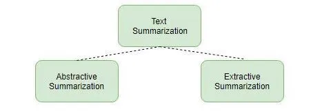
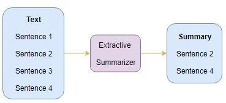
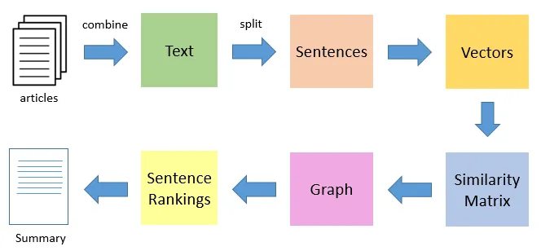
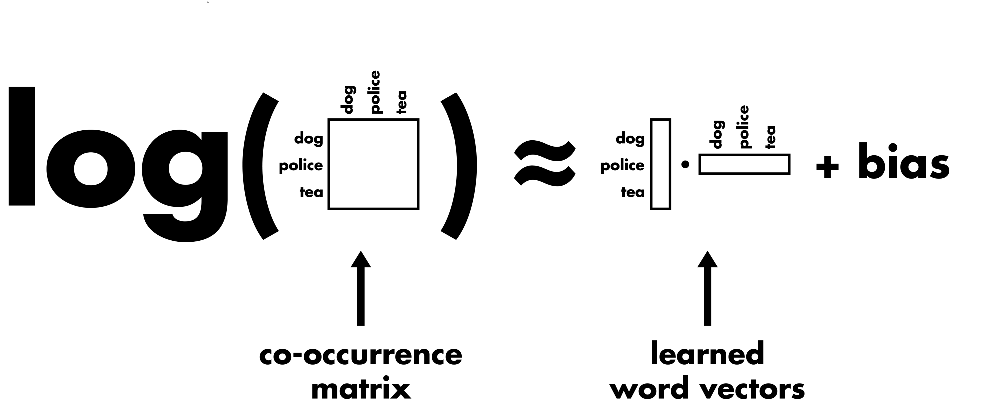
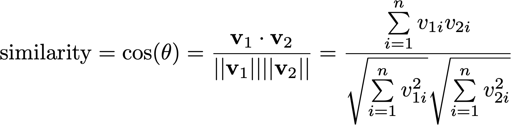

# Text Summarization in NLP
> Automatic text summarization is the task of producing a concise and fluent summary while preserving key information content and overall meaning.

There are broadly two different approaches that are used for text summarization:
* Extractive summarization
* Abstractive summarization

## Extractive Summarization
We identify the important sentences of phrases from the original text and extract only those from the text. Those extracted sentences would be our summary.

### TextRank Algorithm
Share similarities with the PageRank algorithm:
* In place of web pages, we use sentences
* Similarity between any two sentences is used as an equivalent to the web page transition probability
* The similarity scores are stored in a square matrix, similar to the matrix M used for PageRank.

TextRank is an **extractive** and **unsupervised** summarization technique. The following image shows the flow of the TexRank algorithm:

### Steps of TextRank
1. Split the text into individual sentences
2. Find vector representation (word embeddings) for each and every sentence
3. Calculate similarity between sentence vectors and store in a matrix
4. The similarity matrix is then converted into a graph, with sentences as vertices and similarity scores as edges, for setence rank calculation
5. Finally, a certain number of top-ranked sentences form the final summary

#### Text Preprocessing
We make the text as clean as possible, using regex and spaCy to clean and preprocess, including removing stopwords. 

#### Vector Representation of Sentences
Embed the sentences using GloVe (Global Vector) embeddings. We use the pre-trained `Wikipedia2014 + Gigaword 5` GloVe vectors.

Original paper: [http://www.aclweb.org/anthology/D14-1162](http://www.aclweb.org/anthology/D14-1162)

We have word vectors for 400,000 different terms stored in the dictionary of word embeddings. We fetch vectors (each of size 100 elements) for the words in a sentence and then take the mean of those vectors to create a consolidated vector for the sentence.

#### Similarity Matrix Preparation
The next step is to find similarities between the sentences, and we will use the cosin similarity approach. Let's create an empty similarity matrix and populate it with cosin similarities of the sentences. In case you've forgotten, cosine similarity is defined by the following:

#### Applying the PageRank Algorithm
Convert the similarity matrix into a grph using networkX:
* Nodes of the graph will represent the sentences
* Edges will represent the similarity scores between the sentences
Note that this is a complete graph. 

We can now apply the PageRank algorithm to arrive at the sentence ranking.
